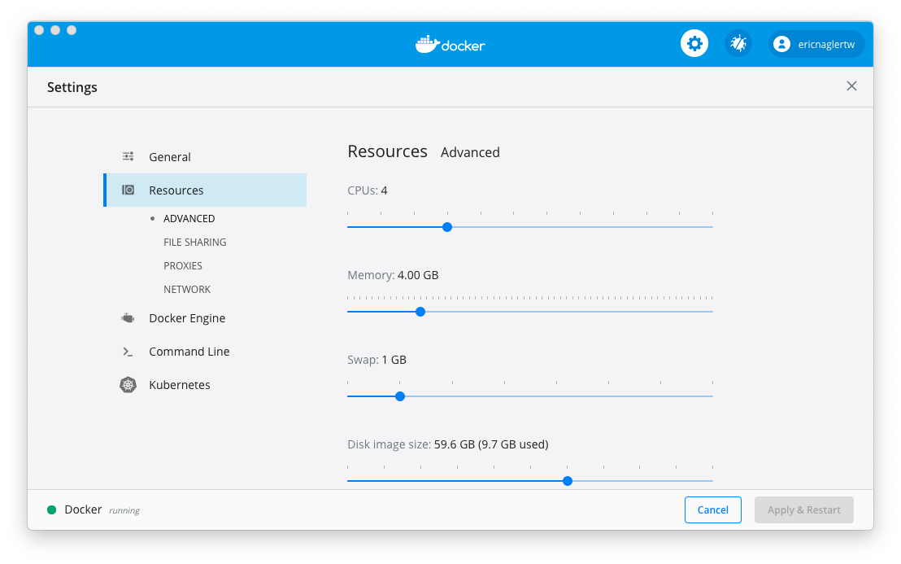

## Setting up your environment 

## Goals

* Setup a development environment for CD4ML including:
* Fork Git Code Repository into Personal GitHub
* Configuring container runtime
* Configuring a python code development environment
* Install Docker Desktop or [an alternative](https://www.rockyourcode.com/docker-desktop-alternatives-for-macos/)

### Github Setup
Navigate to the [Github Personal Access Token page](https://github.com/settings/tokens).

Click "Generate new token" on the top right. You may need to enter your Github password again.

Enter a Note for your personal access token and select the "repo" and "user:email" permissions. Click "Generate Token". See example below


Your personal access token will be created and displayed to you. Make sure you save this token safely because it will not be shown again.

Fork the following [repository](https://github.com/ThoughtWorksInc/CD4ML-Scenarios) into your personal github account.

Clone the repo to your machine
```bash
git clone https://github.com/<Your User Name>/CD4ML-Scenarios
```

### Setting your Jenkins Administrator Password
Create a file called `jenkins-admin-password.txt` in the `jenkins\` folder. On the first line of the file type in a secure password. Save and close the file

### Container Runtimes
We have provided three options for container runtimes:
- Docker Desktop (Windows, macOS and Linux). Free personal licence, but commerical licence required on work computer from January 2022
- Colima (macOS and Linux). Free
- Rancher (Windows, macOS and Linux). Free

#### Docker Desktop Settings Adjustments
Open Docker Desktop by clicking on the docker icon in your Mac or Windows taskbar and selecting Dashboard. Click the gear and select "Resources" and then "Advanced". Increase the RAM allocated to docker to 4 Gigabytes. Click "Apply and Restart".



If you are running the environment on a Windows 10 machine, make sure to switch Docker to Linux-containers instead of Windows Containers.
You can do this by clicking on the Docker icon in your Windows taskbar.
You also need to make sure that your PC can handle virtual environments. This can be switched on or off in your systems BIOS.

#### Colima setup
Follow the instructions for installing Colima and Docker’s CLI with Homebrew from: https://smallsharpsoftwaretools.com/tutorials/use-colima-to-run-docker-containers-on-macos/

When using Colima, immediately before the docker-compose step below, which downloads and starts the development environment, please run

```bash
colima start --cpu 4 --memory 8
```


## Select your development environment
In the next section you can choose from one of two different application development 
environments either using a local machine based development environment or a 
JupyterLab based development environment. When completing the scenario there is no 
difference between the two environments. We recommend that if you are more comfortable 
with the JupyterLab development IDE and environment then select JupyterLab otherwise use 
your already existing development environment.

### Local machine environment
For this workshop we are going to use python3 as our python, pip3 as our dependency manager, 
and virtualenv for python environment management. 
This has been tested on Python 3.9.x and working in a local environment assumes
you have this set up correctly.

First you need to fork this repo to your github account and then clone this environment to your local machine

After you install python run the following commands to start your environment
```bash
git clone https://github.com/<Your User Name>/CD4ML-Scenarios
cd <cloned repo>
docker-compose up -d --build --remove-orphans
pip3 install virtualenv
virtualenv --python=python3 .venv

# On Mac/Linux run the following
source .venv/bin/activate
pip3 install -r requirements.txt

# On Windows Powershell Run:
Set-ExecutionPolicy RemoteSigned
.venv/Scripts/activate.ps1
pip3 install -r requirements.txt
```

Note, if using PyCharm and virtualenv, be sure to select the right python interpreter for PyCharm. 
This is done by clicking on interpreter in the bottom right on the PyCharm window and navigating to the python3 executable in the .venv/bin/ directory. 
That will allow PyCharm to highlight missing libraries and incorrect syntax correctly. If you don't configure this it will show red lines error lines because it can't find the installed libraries.

Depending on how you installed Python, you could run into an SSL error when attempting to run the download data scripts later.

URLError: <urlopen error [SSL: CERTIFICATE_VERIFY_FAILED] ...

If not, ignore this. If so and assuming you are using Mac, you can do this then. Just once.:

Go to Macintosh HD > Applications > Python3.7 folder (or whatever version of python you're using) 

double click on "Install Certificates.command" file. That should fix it. 


### JupyterLab Development Environment
1. Clone the environment to your local machine using `git clone https://github.com/<Your User Name>/CD4ML-Scenarios`
2. Run `docker-compose up -d --build --remove-orphans` to download the images and start the environment
3. Navigate to http://127.0.0.1:8888. The jupyterlab environment will load.
4. From the JupyterLab environment you can open a terminal window by clicking the terminal tile on the home page. Run the following commands to setup the environment. Please fill in the git email and name to your name 
```bash
git config --global user.email "<your email>"
git config --global user.name "<your name>"
pip install -r requirements.txt
```

### Next Steps

At this step you can start setting up the different components of CD4ML. Continue to the [next section](./2-SetupJenkins.md).