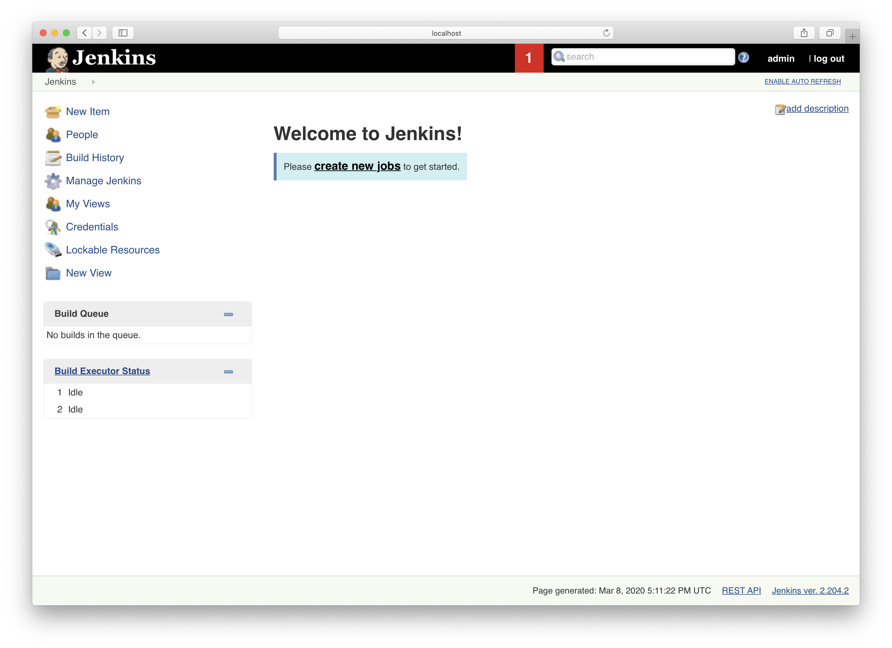
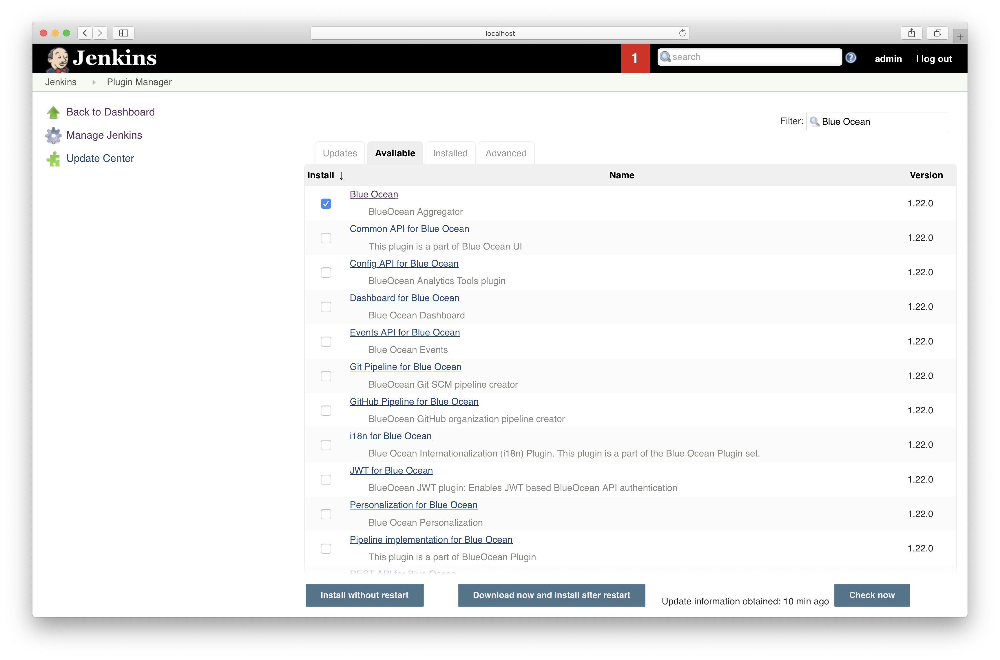

## Setting up Jenkins

## Goals

* Learn about [Jenkins](https://www.jenkins.io/)
* Setup and Configure a [Deployment Pipeline](https://martinfowler.com/bliki/DeploymentPipeline.html) to build and deploy your application to production
* Deploy to the Model server running in production

#### Retrieving your Jenkins Administrator Password

Run the following command from your terminal. Make sure you save this password.
```bash
docker exec -it jenkins cat /var/jenkins_home/secrets/initialAdminPassword
```

Navigate to the [Jenkins Home Page](http://localhost:10000), you should see a message to unlock Jenkins. Enter the admin password to start the setup process.

Click the "Select Install Default Plugins" option. Jenkins will then begin to configure it's self.

After the installation is completed, select "Continue as admin" then "Save and Finish" and then "Start Using Jenkins".

At this step you'll be presented with the Jenkins Home Page shown below.



Select "Manage Jenkins" on the left. Then, select "Manage Plugins". On the Plugin Manager page, select the "Available" Tab. Using the search filter on the top right, search "Blue Ocean" and for "Poll SCM". Install both of these plugins.



Click "Download Now and Install after Restart". This will take you to the plugin install page. Check the bottom check box, "Restart Jenkins when installation is complete and no jobs are running". Wait for the install to finish and Jenkins will restart.

Navigate to [Jenkins Blue Ocean](http://localhost:10000/blue) and log in to the following home screen.


Select "Create a Pipeline".

Click "GitHub".

Enter your Github Personal Access Token.

Select your github account, then CD4ML-Scenarios and "Create Pipeline"

At this step the pipeline will build, you can select the pipeline to see the individual steps execute. At the end the pipeline should be 'green' indicating that all the steps were successful (shown below).

