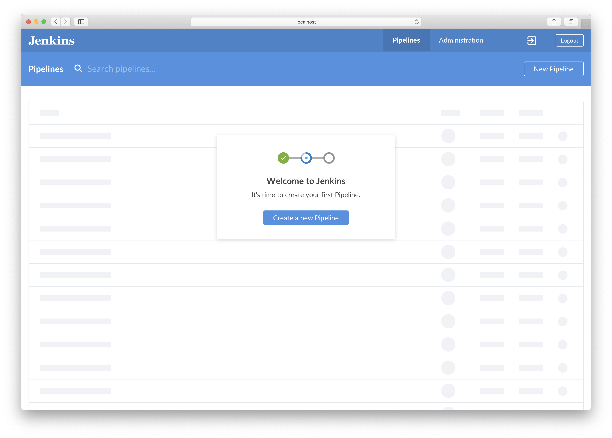
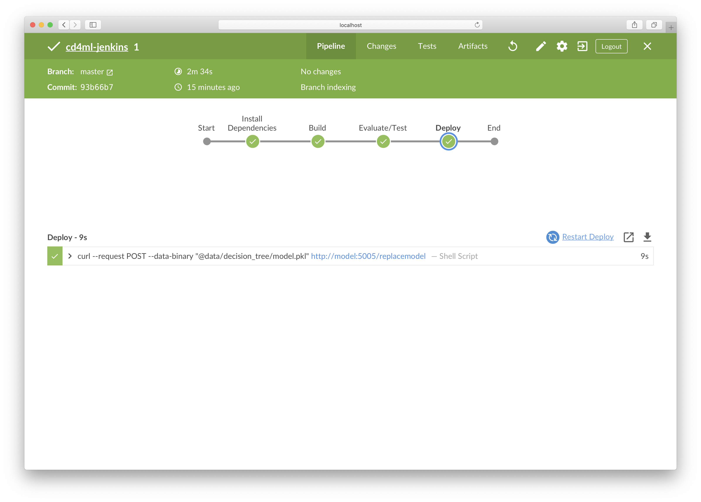
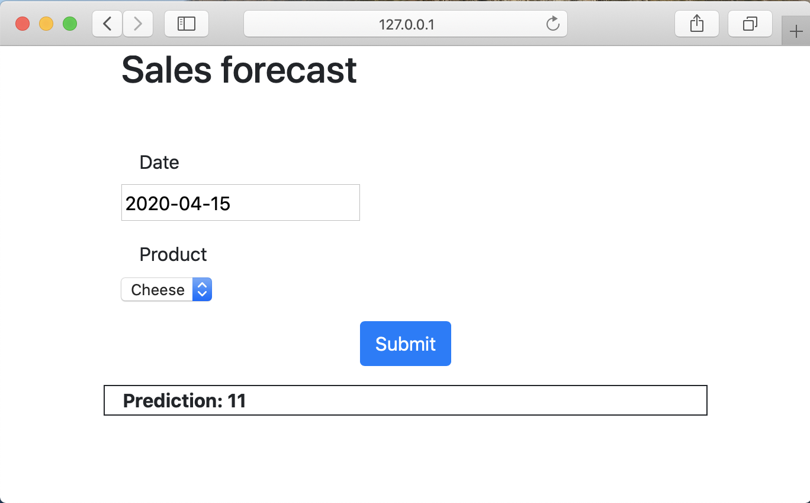

## Setting up Jenkins

## Goals

* Learn about [Jenkins](https://jenkins.io/)
* Setup and Configure a [Deployment Pipeline](https://martinfowler.com/bliki/DeploymentPipeline.html) to build and deploy your application to production
* Deploy to the Model server running in production

Navigate to [Jenkins](http://localhost:10000/blue). After you log in you will be presented with the Jenkins Blue Ocean welcome page.
 

Select "Create a Pipeline".

Click "GitHub".

Enter your Github Personal Access Token.

Select your github account, then cd4ml-scenarios and click "Create Pipeline"

At this step the pipeline will build, you can select the pipeline to see the individual steps execute. At the end the pipeline should be 'green' indicating that all the steps were successful (shown below).

Now try to run the model in production by clicking this [link](http://localhost:11000).

Select a date and a product and click submit. You will see the prediction of the customer demand of this product at this date.

