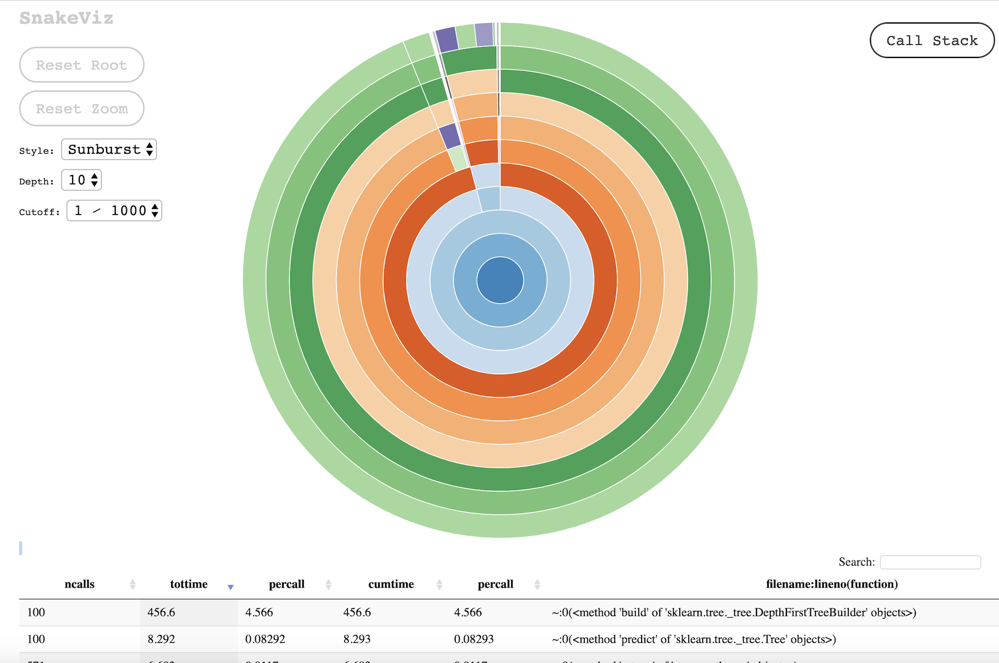
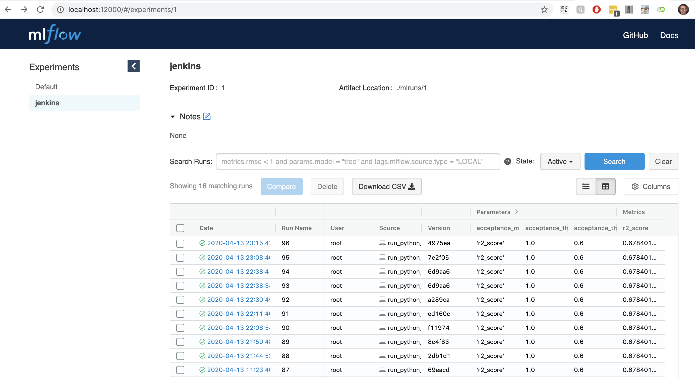

# Instructions for running ML pipeline

## Run the pipeline with different model parameters

Goals

* Run python pipeline locally
* Make a change and run again to see the effects

### Run the tests locally

If you want to run things locally, you can follow this recipe. If you just want
to run things with Jenkins, you can skip this. Running with Jenkins requires that
you commit and push the code changes. 

```bash
./run_tests.sh
```

Should output something like
32 passed, 2 skipped in 5.73 seconds
and without any flake8 comments

Flake8 checks for style violations. We suggest you stick to standard PEP8 style
guidelines. If you use the PyCharm IDE (or other IDEs properly-configured), it will show
style violations while you type. If however, you miss some, this Flake8 checker will
cause it to fail the test stage. If that is undesirable, it can be removed 
from run_tests.sh.

Once the shell has been activated, which you can do with 
```bash
source .venv/bin/activate
```

you can run the ML pipeline with

```bash
python3 run_python_script.py pipeline
```

This will run the ML pipeline. It may takes a few minutes. It will run the random forest 
algorithm and output a performance metric. 

`{'r2_score': 0.678401327984714}`

This run_python_script.py file is a script runner. This is a nice way to run scripts which import 
all the code in the cd4ml module without having to monkey around with paths. All script should put
in the scripts directory and have a function named main. See the two scripts pipeline.py 
and acceptance.py. If you add another script you have to edit run_python_script.py (in two places)
to know which script to call given a script name. 

If you add a -p flag on the end
```bash
python3 run_python_script.py pipeline -p
```

it will run with the profiler on and create a file like pipeline.prof. You can then view it with 
the interactive "snakeviz" to see where it is spending most of the time. 
```bash
snakeviz pipeline.prof
```



In you look at Jenkinsfile, you'll see all the stages that Jenkins runs including this 
python script above.

Let's make a change to the random forest parameters and see if there is a change in the score.

in cd4ml/ml_model_params.py you will see all of the model parameters for each of the models.

Let's change the n_estimators from 10 to a higher number like 100. This is the number of trees
in the forest. Generally higher numbers lead to better metrics until it begins to saturate. It
will effect runtime and memory usage. 

After changing this you can either run it locally like we did above or run through Jenkins. If
you run through Jenkins, you'll have to commit your changes and push your code because Jenkins will
read from the Github repo. 

```bash
git commit . -m "Change to 100 trees"
git pull -r
git push
```

Then run the pipeline through Jenkins like you did before. Note, if you run it locally, it won't 
run the acceptance test or update the model scoring app. Those are are separate commands as you
can see in the Jenkins file. You could run those locally commands too if you wanted.

There are other parameters that govern how the pipeline runs. Those other parameters are in
cd4ml/pipeline_params.py

You could for example change the model from "random_forest" to "decision_tree" or any model 
included in ml_model_params.py. If you want to add another scikit-learn model, just add the model
to model_utils.py and params to ml_model_params.py. Everything should work the same. There is no
(and there should be no) model specific logic elsewhere in the pipeline. That is an example of
separation of concerns. After the model is chosen and configured, it should appear to be a 
generic black box to all other parts of the pipeline. 

Note that some choices of model or configurations might not pass the acceptance test stage. 
If you need to adjust those thresholds, you can do so in pipeline_params.py. 

## ML Flow

Open your browser to the following page to see MLflow.

[http://localhost:12000/#/](http://localhost:12000/#/)

On the left, under experiments, click on jenkins to see the jobs launched from 
the jenkins server.

If you run the pipeline through Jenkins at least once, you will see a list of runs in the 
table with the metric r2_score on the far right. Click on the date field to se more information.

One of the most important thing recorded is the git commit hash. So if you ever need to roll back
to a previous model, you can check out that version of the code or at least check the parameters
to see what they were.




# Codebase characteristics

## Configuration strategy

Note that we only have two configuration files pipeline_params.py and ml_model_params.py. The
pipeline_params object includes ml_models params as a sub-object. So this single object 
is responsible for all configuration.

It is important to create this object only once at the head of the pipeline. You can see it 
is read (or imported rather) in scripts/pipeline.py. It should not be read/imported anywhere else
but the top of the pipeline. It is read there and passed down to other functions. 

The reason why this is a good idea is that it gives you full programmatic control. If you 
wanted to run the pipeline 50 times with 50 parameters and gather the performance metrics, you
could do that. You would just read the parameters at the top levels and run a loop where you 
modify some parameters before running the pipeline. Note that if you read/imported the 
params at various places in the code, this might not work. Even if you got it to work, it could
prove brittle and bug prone. 

## Streaming design

As discussed in the presentation, we try to maintain a preference for streaming over batch.
You'll see all of the paths and filenames in the  file called cd4ml/filenames.py. That is so
paths and names are not sprinkled throughout the code and hard to locate. 

The stream reader is in cd4ml/read_data.py and it called some lower level functions. Currently
it just runs from reading a csv file but we are in the process of adding postgres as an option.

## One hot encoding

Notice that we use our own one-hot-encoder to convert each categorical variable to a set 
of Boolean ones. This was done because of some shortcomings of the one included in scikit-learn. 
First of all, theirs is not complete and so needs lots of wrapper code around it anyway. 

Ours has some nice features

* All written in python with tests
* Can run on data streams without requiring batch loading or batch scoring
* Has easy persistence built in. Persistence of one-hot encoder is required for repeatability.
* Makes it easy to transform back and forth between original and encoded forms
* Allows for control over maximum number of encoded levels. Aids with memory use.
* Is configurable through a single data structure, allowing for easy hyper-parameter tuning

## Future improvements

We will continue to work on and improve this codebase. Primarily it is intended to teach the 
concepts of CD4ML but should also be a useful starting place for real projects. Be sure to 
read our License concerning use. We will continue to improve the design and add functionality
and may make use of it in actual project work. At such a time, more emphasis would be paid to 
security. Overall, we prefer a library versus framework approach to machine learning. 
We find, especially in our work as consultants, that frameworks will never be flexible enough 
to work in all the varied environments we encounter. That is, we prefer to maintain a large 
set of modular components or libraries that can be selected from and arranged in different 
patterns to fit almost any ecosystem or at least reduce the time required to built what is 
needed.
