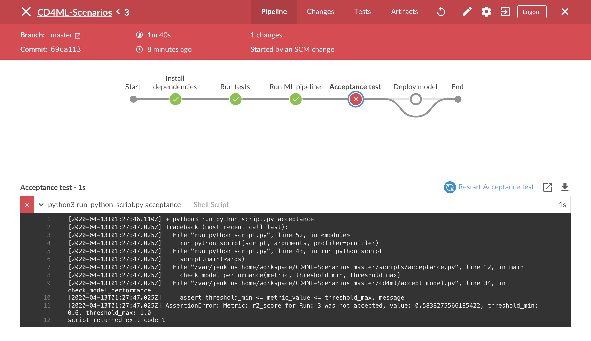

## Continuous Deployment - Undo Changes

## Goals

* Observe the continuous deployment pipeline acceptance check
* Learn how to revert your code to a previous commit

## Steps

* Open the `cd4ml/ml_model_params.py` file.
* Adjust the number of `n_estimators` in random_forests from 50 to 5
* Run the following to commit and push you adjustments
```bash
git add cd4ml/ml_model_params.py
git commit -m "Adjust number of n_estimators to 5"
git push
``` 
Notice that your build should have failed because the prediction accuracy with this estimator are not high enough. 



Let's revert this commit back to it's original estimation values. Run 
```bash
git revert HEAD
git push
```

After reverting your change your build should go green!

Continue to the [next section](./6-KibanaLogVisualization.md) to visualize your model results in real time. 