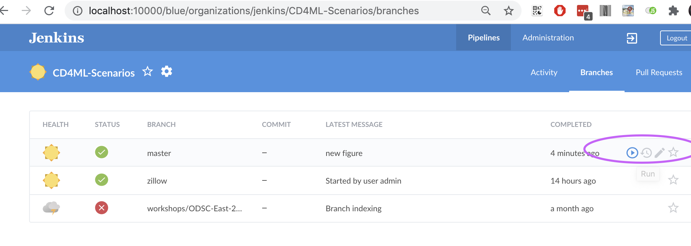
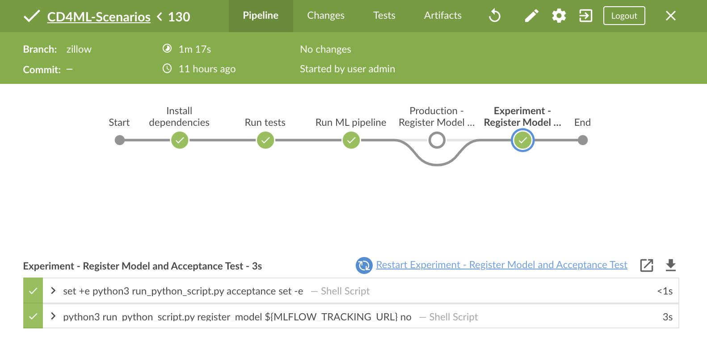

# Exercise 3 - Data Science and Machine Learning

## Goals

* Learn to do experiments without interrupting the rest of your team or changing 
the production model
* Learn about the codebase design and how it enables great flexibility while
maintaining reproducibility

## Step by Step Instructions

1) Run the pipeline on the housing problem through the Jenkins UI with default parameters.
Go to http://localhost:10000. Log into Jenkins if you need to. Open Blue Ocean (on left)
if it's not open. Click on the CD4ML-Scenarios pipeline. Then Branches. Then play button on the right side of master branch. 

When it is done, click on the pipeline to see that it finishes green for success.

2) Run the pipeline on the housing problem through the Jenkins UI but instead of
using the defaults, change the algorithm to 'lasso' and the parameters 
to 'big_alpha'. 

3) While this is running, look in the `cd4ml/problems` directory. 
This will show the two problems: houses and groceries. Look in houses 
and note the directories. Three of these correspond with three of the 
four text boxes in the Jenkins UI: algorithms, features and ml_pipelines. 
Click on algorithms and you'll see directories corresponding to the 
available algorithms. Each directory contains a list of parameter sets.
All have at least one called default.json which will be the default
params for that algorithm if it is chosen without the params text box 
being changed to something else. 

    Note in the lasso directory, there is a file called big_alpha.json which
corresponds to the 'big_alpha' that we typed into that text box. It has 
an alpha parameter of 50 rather than 1 and so [encourages sparseness](https://chrisalbon.com/code/machine_learning/linear_regression/effect_of_alpha_on_lasso_regression/) 
more than the default. 

    The idea is that you don't modify the defaults very often and certainly 
don't do so in order to experiment. Make new files with your alternative 
parameter sets. That way, it won't affect your colleagues and won't 
change the official model that is deployed. Just make a new file in the
relevant algorithm directory, commit and push and then Jenkins will be 
able to find those parameters and build that particular model.

4) Go back Jenkins and observe that the model succeeded. Note that 
it was identified as an experiment due to using non-default parameters. 
The pipeline therefore skipped the production 'register model' step and ran the experiment step instead.

This lets us use Jenkins like an [ML training orchestration platform](https://github.com/EthicalML/awesome-production-machine-learning#model-training-orchestration).

5) Look in the feature set directory and you can see similarly how to create alternative
feature sets. Optionally copy the default subdirectory to a new one of another name and edit one or
both of those files. 

    If you create a new feature set, you can select it in the Jenkins
UI as well but need to make another edit in cd4ml/problems/houses/problem.py. To do this, add another
option around line 34 to import your new feature set if is to be selected. Unlike 
algorithms and params, it won't be discovered automatically without that change. This happens to be the way we've 
implemented this but it's not unusual that feature changes require a code change rather than just a run parameter change.

6) Look at the ml_pipeline directory. Similarly, it contains a default.json file. 
This file contains information such as the default algorithm and the information for 
training and validation splitting. Training and validation percentages do not need to 
add up to 100%. You can run on much smaller data sets by making both of them small. It also
specifies the primary ML metric as well as it's range of accepted values. We describe this
in later sections. 

Continue on to the [next section](./4-ContinuousDelivery.md)