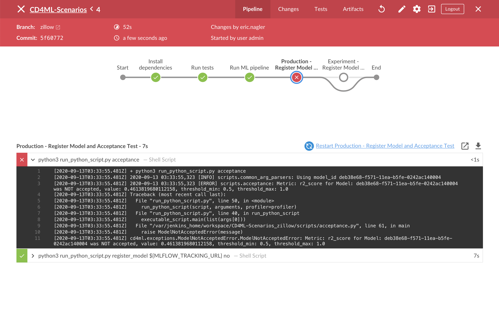
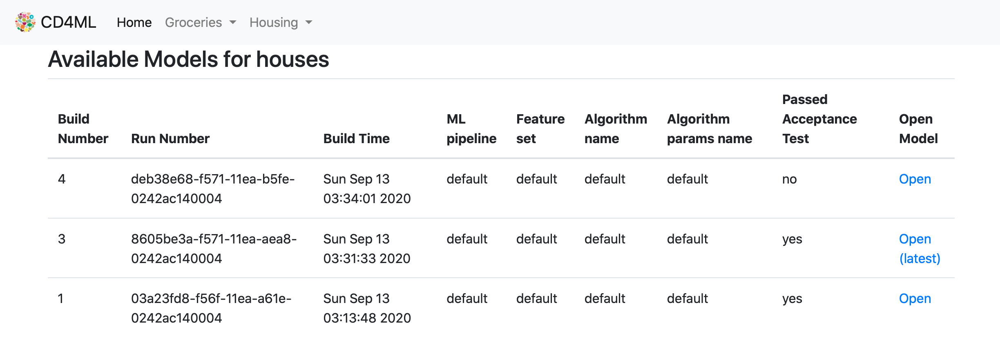

# Exercise 4 - Continuous Delivery

## Goals

* Learn about the principles of Continuous Deployment
* Demonstrate a CD quality check, ensuring that our changes don't impact production applications

## Step by Step Instructions

In the following exercise we are going to demonstrate how a continuous deployment check can ensure that errors if introduced do not impact an application running in production. This ensures a continuous deployment cycle and that deploying to production is easy and a non-event. To simulate this we are going to adjust the acceptance threshold too high to reject the model, but other additional reasons include:

* Data changing when re-training, causing a performance drop
* Unintended code adjustments effecting training pipeline

In the previous section you were testing out and running experiments to work toward improving the accuracy of the model. Let's start by taking one of those experiments and put it into production. To demonstrate if the acceptance test is working properly lets first change the minimum acceptance criteria from 0.42 to 0.50.

1. Open the file `cd4ml/problems/houses/ml_pipelines/default.json`. Adjust the `acceptance_threshold_min` from `0.42` to `0.50`
2. Commit our code using:
    ```bash
    git add .
    git commit -m "Adjust acceptance_threshold_min from 0.42 to 0.5"
    git push
    ```
3. The pipeline should run automatically (Jenkins polls github) and we should see the pipeline go red indicating a build error:
   
4. The logging error indicates a build error, and that trained model score was not accepted. We can see that this error does not impact the production model because if we navigate to the all [models listing](http://localhost:11000/houses/models) of the housing scenario it indicates that the new model is not the latest model, hence is not what production uses (Build Number 3).

    
   This page shows us [registered models](https://www.phdata.io/blog/what-is-a-model-registry/) tracked with [mlflow](http://localhost:12000/).
    
Let's fix the red pipeline by adjusting our default parameters to be the lasso model. The model will then perform well enough to meet the new threshold.

Open the file `cd4ml/problems/houses/ml_pipelines/default.json` and change the `default_algorithm` to `lasso`. Next, navigate to `cd4ml/problems/houses/algorithms/lasso`. Copy the contents of `big_alpha.json` into `default.json`. Save and commit your code.
```sh
git add .
git commit -m "Adjust to use lasso as default algorithm"
git push
```
After you push your code your pipeline should be green and you can refresh your model listing page to show that your latest build will be model used in production.

Next, let's visualize our results. Continue to [Kibana Visualization](./5-KibanaLogVisualization.md)